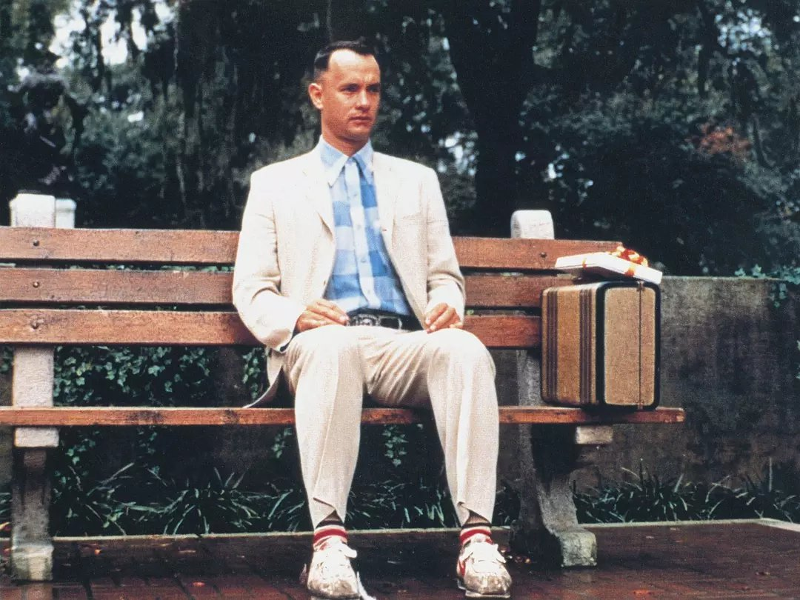

>人生就像一盒巧克力，你永远不知道下一块会是什么。
                                                                              ——电影《阿甘正传》

生物信息到底是什么？在学生物的人看来，就是敲代码的，甚至要负责修电脑，而在计算机专业人士看来，还是搞生物的。

关于如何成为一个优秀的人，吴军老师说过，你要跨专业，一个专业做到前50%，另一个专业也做到前50%，那么你就进前25%了。而生信，恰好就是生物学和计算机的交叉学科，假如班上100个学生，你生物进前50名，那么在这50个人中，如果你计算机也能排前50%，那么你就进入前四分之一了。因此，**跨界，是在职场上取得优势的捷径。**

搞生信的很多都半路出家，我也一样，一开始并不知道自己想要什么，跌跌撞撞，走到今天。

## 01 我的大学
21世纪是生物的世纪，“后浪”们总是对此深信不疑。

高中的时候，做做DNA双螺旋模型当玩具放在课桌上，的确很有趣，不过来到大学，进入实验室，发现完全不是那么回事，我极度讨厌实验。

闻到培养基的味道就难受，分子生物学实验怕接触有毒物品，最少要戴三层塑料手套操作（总让老师失望），做动物解剖（如青蛙，兔子等）不敢下手。

为了顺利毕业，硬着头皮去做的那些生物化学、分子生物学、组织培养、发育生物学等等实验，至今想来都不寒而栗、极为痛苦。以至于到了大二，再也无心专业的学习，经常逃课，成绩只求60分能过。

不过好在我一直对计算机感兴趣，高中时有了第一台笔记本电脑，不过主要用来上网和看电影，仅学会了五笔字型输入法，一点VB编程。

大一时设计过网站，先是到图书馆借了一堆书，做出来的成品，是相当简陋的：几乎全是HTML的静态页面，少量`CSS`和网上拷来的`JavaScript`代码（微笑）。

慢慢地，发现自己喜欢编程，喜欢输入代码，立即就能得到验证的感觉，这太爽了。而做实验，等结果少则几小时，多则几天、几月、几年，而编程则没有这种烦恼。

当时流行的编程语言有：`VB、C、C++、Java`等，学什么呢？我选了`C++`，陆续看了C++ primer, C++编程思想，Effective C++等，从头到尾，把示例代码在电脑里都敲一遍。为了编程，有时通宵达旦，废寝忘食。好在天道酬勤，打下了编程的基础，至少弄懂了类、对象、继承、多态等这些面向对象编程的核心概念。

有人问，`C++`很难，你一个生物专业的怎么会去学它？这或者是我性格决定的：**要么不做，要做就做到最好。** 五笔难，但很有用，就学五笔，`C++`难，但很强大，就坚持学。

**不怕麻烦，好的东西，当然要花大的努力去得到。**

## 02 生信！生信！
毕业后，靠`C++`，我如愿以偿，成了一个码农。工作很忙，压力大，加班、熬夜是常态，一干就是两年。渐渐地，开始担忧自己的前途，毕竟非IT科班出身，职业生涯很容易碰到天花板，有些不甘心，遂产生了考研的想法。

经过上网查询，知道有生物信息学这样一个专业，需要考四门课：

- 英语
- 政治
- 生物综合
- 计算机

其中计算机比较容易，只要着重认真准备其他三门课就好了，经过半年的努力，我来到了四川大学，实验室主要做基因组二代测序方面的课题，从此也算是科班的人了。

课业是繁重的，看论文，做研究，写文章，时间总是过得很快，不经意间，就面临毕业。

关于考博，想过，毕竟国内目前还是比较认可文凭的，但确信自己不是做科研的料，还是安心到产业界发展，别挣扎了。

## 03 科研服务
人类基因组计划产生了海量数据，为了解读这些数据，迫切需要生物信息学提供支持。陈润生院士说生信主要解决四个方面的问题：

- 基因组如何获得：如基因组序列的组装;
- 基因组里有什么：基因组注释，本质上是数学问题，比如基因识别，就属于分类问题；
- 比较基因组学：各种重测序项目，如肿瘤基因测序等;
- 生物进化：永恒的主题。

既然要混产业界，怎么开始呢？从基因组组装、注释开始吧，于是进入成都一家科研测序服务公司（主要为高校或研究所的客户提供二代或三代测序和生物信息分析服务），动物、植物、微生物、病毒、线粒体、叶绿体，两年下来，大小项目数百个，每年都是优秀员工，正当公司领导对我有更大的期待时，我的眼光却忍不住望向了别处。

2018年，精准医疗的概念在国际和国内已经很热了，从奥巴马总统的国情咨文，到我们国家的精准医疗计划，激动不已的业内外人士都声称这是媲美阿波罗登月的工程，大家热情高涨，似乎人类攻克癌症，摆脱疾病的痛苦指日可待。

转向临床，到产业的最前沿去，一个声音对我说。于是，向基因测序领域Top 2大厂投递简历，一南一北，最想去的是南方那家，但北京的先发了offer，想想帝都也挻好的，海明威说过：
>假如你有幸在年轻时在巴黎生活过，那么你此后一生不论去到哪里，她都与你同在，因为巴黎，是一席流动的盛宴。

趁心中还有梦想，还年轻，到一线城市增长见识，以后不管到哪里，也可以说，我努力过，人生不留遗憾。

## 04 北漂：从科研到临床
新公司年轻员工多，工作节奏快。事业部做肿瘤基因检测，主要模式是与医院共建实验室。作为生物信息工程师，日常工作是开发生信分析流程，修复BUG，以及做一些科研项目。当然，免不了出差，给各地的合作医院安装/升级生信分析流程，以及给医生们讲解临床测序数据分析的原理。

2020年注定不平凡，疫情下的北京，小区封闭式管理，在家办公二个多月，同时也多了些思考，深感肿瘤基因检测的发展进入了一个瓶颈期，各家公司的产品高度同质化，而微生物临床基因检测，此前行业重视度不够，似乎是一片蓝海。

此时恰好有一家初创公司邀请我去研发微生物基因检测产品，这正是我想尝试的领域，因此双方一拍即合（当然，换工作要综合考虑公司、团队、项目和待遇等，毕竟要挣钱养家，可不能闹着玩儿）。

**我的经验是，机会随时有，关键是你要提前做好准备，机会来临时才能紧紧抓住。**

有新的去处后，提离职，公司领导极力挽留，承诺留下的话可给一定股权，这是对我两年努力工作的最大褒奖，无奈去意已决，希望江湖不远，后会有期吧！

## 05 后记
**人的命运受主观和客观两个方面的影响**，你的视野和格局，往往受自身和环境的限制。我当初并没有想过，会从事现在这份职业，因为考研之前，都不知道有生物信息这个专业，也没有人告诉我。

在时间的长河中，我们不过是过客，个人受时代潮流的裹挟，总不知下一步会去到何方。幸好我们并不孤独，一路上有亲密的家人，还有同行的朋友。

最后，以一首词来结束对往事的追忆罢！

>**
长 相 思·山一程
**
    
[清] 纳兰性德
 
    
山一程，水一程， 
    身向榆关那畔行， 
    夜深千帐灯。  
    风一更，雪一更， 
    聒碎乡心梦不成， 
    故园无此声。  

