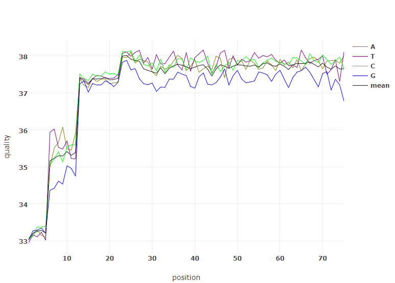
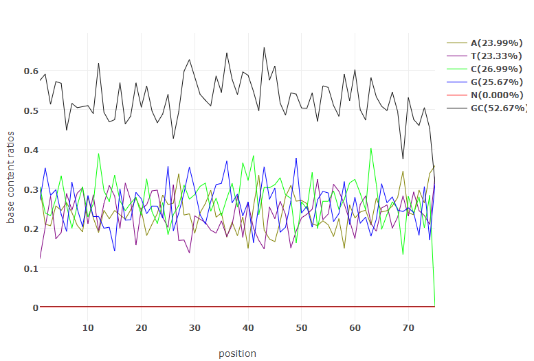

接上一篇，数据拆分完成后，得到FASTQ文件，下面对数据进行质控。


当前主流测序平台的数据存储格式无外乎两种，FASTQ（Illumina, MGI），BAM（Life Ion Torrent，PacBio），对于BAM文件，通常也需要先转换成FASTQ文件后再进行质控处理。


质控软件非常多，有FastQC，Cutadapt， Trimomatic等，通常需要多款软件共同配合使用，这难免过于繁琐，在实际项目中，推荐用[fastp](https://github.com/OpenGene/fastp)，根据官网介绍，这是一款处理FASTQ文件的all-in-one软件，质控用它就够了，下面是扩增子数据的质控命令。

```bash
/path/to/fastp -i $fq1 -I $fq2 \
-h ${outdir}/${sample}_merge_clean.html \
-j ${outdir}/${sample}_merge_clean.json \
-m --merged_out ${outdir}/${sample}_merge_clean.fastq.gz \
--failed_out ${outdir}/${sample}_failed.fastq.gz \
--include_unmerged \
--overlap_len_require 6 \
--overlap_diff_percent_limit 20 \
--detect_adapter_for_pe \
-5 \
-r \
-l 20 \
-n 5\
-y \
--thead 10
```


参数解释：

`-i $fq1`，输入样本的FASTQ1文件，可以是gz压缩格式；

`-I $fq2`，输入样本的FASTQ2文件，可以是gz压缩格式；

`-h ${outdir}/${sample}_merge_clean.html`，输出html格式的质控报告；

`-j ${outdir}/${sample}_merge_clean.json`，输出json格式的质控报告；

`-m`，合并双端reads模式，设定该参数时满足条件的双端reads会合并在一起；

`--merged_out ${outdir}/${sample}_merge_clean.fastq.gz`，输出合并后的结果文件；

`--failed_out ${outdir}/${sample}_failed.fastq.gz`，保存被过滤掉的reads到该文件中；

`--include_unmerged`，设定该参数，未能合并的reads也包含在结果文件中，否则默认是不包含的；

`--overlap_len_require 6`，合并的条件一：双端reads至少有6bp重叠；

`--overlap_diff_percent_limit 20`，合并条件二：重叠区域最多允许有20%的碱基错配；

`--detect_adapter_for_pe`，自动检测双端测序的接头序列并切除，默认只自动检测单端数据的接头序列；

`-5`，从5'端开始滑动一个窗口，如果窗口内碱基的平均质量低于某个阈值，则剪切掉窗口内的序列，否则停止剪切;

`-r`, 从5'端开始滑动一个窗口，如果窗口内碱基的平均质量低于某个阈值，则剪切掉窗口内以及其后的所有序列;

`-l 20`，丢弃长度低于20bp的序列；

`-n 5`，read中N碱基数不能超过5个；

`-y`，低复杂度过滤；

`--thead 10`，指定10条工作线程；


以上命令除了常规的剪切、过滤操作外，还进行了双端reads的合并，最终结果如下 ：

```bash
wenku1
|___wenku1_failed.fastq.gz        被过滤掉的reads结果文件
|___wenku1_merge_clean.fastq.gz   通过质控的reads结果文件
|___wenku1_merge_clean.html       html质控报告
|___wenku1_merge_clean.json       json质控报告
```

通过html质控报告，可以直观地看出很多指标，如过滤前后的reads数、bases数、碱基质量、插入片段长度、碱基组成、GC含量、接头类别等，如：




<center>碱基质量：横坐标是read的碱基位置，纵坐标是碱基的phred值</center>




<center>碱基组成：横坐标是read的碱基位置，纵坐标是碱基组成百分比</center>

此外，也可以通过编写脚本读取json报告的内容，生成个性化的质控报告。

## 质控知识小结

数据质控的目的是为了过滤掉那些不好的序列，从而减小对下游数据分析的干扰。


下面是一条FASTQ格式的序列，我们能对它进行些什么操作呢？主要有剪切、过滤、碱基质量校正等。

```bash
@M06862:6:000000000-C9TL7:1:1102:17871:1939 1:N:0:ATTACTCG+GGCTCTGA
GCCCTCTTTGTCCTCCTTGGTGAGAACCAGGGCCTCGACCTCATCGCCCACGGAAACGACCTCGTTGGGGTCGA
+
1111>>CFF3F@EGEEGGB1G1BGHGHHGFA0AAFF0EEGGHGHHBEEE?FGCEGGHFCEEGHAHGHFC?GG??
```


为什么要剪切read，无非是因为read中要么含有接头，要么含有低质量序列，这些信息对我们没用，甚至对分析结果造成干扰。

**1.接头序列剪切**

如果read中含有接头序列，则从接头开始的地方删除至read末尾。接头序列的来源可能是因为测序片段的长度低于测序的读长，从而被测通导致的，另外也不排除接头之间形成了二聚体，测出来的只有接头序列。

**2.低质量序列剪切**

Illumina测序仪的特性，低质量序列可能位于5'端，3'端或者read的中间，对应的处理方式有这几种：

- 从5'端开始滑动一个窗口，如果窗口内碱基的平均质量低于某个阈值，则剪切掉窗口内的序列，否则停止剪切
- 从3'端开始滑动一个窗口，如果窗口内碱基的平均质量低于某个阈值，则剪切掉窗口内的序列，否则停止剪切
- 从5'端开始滑动一个窗口，如果窗口内碱基的平均质量低于某个阈值，则剪切掉窗口内以及其后的所有序列

通过以上几种方法，就可以剪切掉5'端和3'端的低质量序列，如果低质量序列位于read中间，则剪切掉该低质量序列及其后的所有序列。

**3.全局剪切**

以上去掉低质量序列的方式是有条件的，需要满足一定的阈值才会进行，也可以直接剪切掉read的头部和尾部，通常做法是：

- 去掉5'端一定数量碱基
- 去掉3'端一定数据碱基
- 或者限定read的最大长度，当read的长度超过限定值时，其尾部序列会被剪切掉

**4.polyG剪切**

双色发光法的Illumina设备（NextSeq /NovaSeq），在没有光信号情况下base calling的结果会返回G，所以在序列的尾端可能会出现较多的polyG，需要被去除。

**5.polyX**

如果3'端存在polyX（如mRNA-Seq数据中的polyA），可以剪切掉。


完成了剪切，下面就是过滤了。

**1.质量过滤**

对于低质量reads，应直接丢弃，有如下方式：

- 按低质量碱基占read的比例，如达到40%，则过滤掉，当然需要先定义低质量碱基的阈值，如phred quality < Q15
- 按read中碱基的平均质量，如低于30，则过滤掉

**2.N碱基过滤**

测序过程中某个碱基无法识别时，体现在read中可能是一个大写N字母，当这样的N碱基过多时，则过滤掉该read。

**3.低复杂度过滤**

复杂度的定义是read中与下一个碱基不同的碱基的百分比（base[i] != base[i+1]）。

```bash
# a 51-bp sequence, with 3 bases that is different from its next base

seq ='AAAATTTTTTTTTTTTTTTTTTTTTGGGGGGGGGGGGGGGGGGGGGGCCCC'

complexity = 3/(51-1) = 6%
```

这样的序列在靶向测序中，通常是不应该存在的，因此需要去除。

**4.长度过滤**

过滤掉太短或太长的序列：

- 长度太短，过滤掉
- 长度太长，过滤掉


此外，为了降低测序错误产生的噪声，质控时还可以对碱基的质量进行校正，通常的做法有：

**1.PE数据碱基校正**

当双端测序的配对reads之间有overlap并且有错配时，如果错配碱基一个质量很高，一个质量很低，则进行碱基及其质量的校正。

**2.UMI标签**

通过UMI标签来消除重复和测序错误，这通常在超高深度的测序数据中用到。


至此，质控部分就讲完了，下一篇介绍聚类分析。


上一篇回顾：

[病原微生物扩增子数据分析实战（一）：bcl2fastq软件完成数据拆分](https://mp.weixin.qq.com/s?__biz=MzIxMjQxMDYxNA==&mid=2247483860&idx=1&sn=75f5503b79466b32d0897f6b0e831f42&chksm=9747c84da030415b822c3b086304f0e61a7e41bd34bfc903e9e32a933227004d958433a35f56&token=1537398109&lang=zh_CN#rd)

