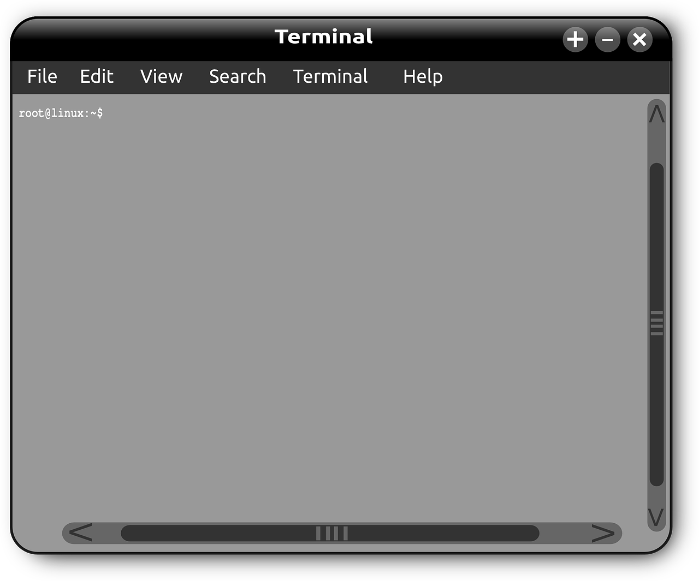

我之前的文章说过，搞生信的理想工作设备是`Mac电脑+Linux服务器`，但是有些同学还是工作在Windows平台下，或者公司只配置了Windows电脑（这是常态）。

这个时候，传统做法是先装一个虚拟机，比如大名鼎鼎的VMware，再在虚拟机中装Linux系统，这有一个非常大的缺点，就是虚拟机非常占电脑的硬件资源，另外启动也需要花费一定的时间，不太方便。

有没有更好的方法？答案是有的，并且强烈推荐：`Windows Terminal + WSL`。

`WSL`，[Windows Subsystem for Linux](https://docs.microsoft.com/zh-cn/windows/wsl/about)的缩写，意思是Windows内置Linux子系统，即无需虚拟机，直接在Windows下提供Linux运行环境，能够支持大多数命令行工具、程序和应用，这对我们来说是非常有用的。

举例来说：

- 学习linux。`WSL`提供常用的linux命令支持，如`ls、cd、cat、less、tar`，以及文本处理三驾马车`sed、grep、awk`，新手完全可以在`WSL`下入门Linux。

- 学习脚本语言。可以在`WSL`下学习`Python、Perl`等脚本语言。

- 为远程工作提供终端。Windows的终端工具`Windows Terminal`非常强大，由于又安装了`WSL`获得了Linux支持，我们可以在终端下通过Linux命令`ssh`完成远程登录，以及通过`scp`命令完成本地与远程服务器之间的文件传输，这通常就足够了。

  

因为我们的日常工作流程通常是这样的：

1、登录服务器(`ssh`命令)，看有什么工作需要处理；

2、如果本地有文件需要传到服务器，则用`scp`命令；

3、在服务器上完成数据分析，运用各种命令、软件、分析流程等，必要时写一些脚本协助处理；

4、分析结果打包，用`tar`命令；

5、打包结果传回本地电脑，还是用`scp`命令；

6、结果发送给客户或其他同事。

整个流程都可以在Windows Terminal中完成，不再需要传统的xshell，SecureCRT，以及Filezilla等软件。

因此，`Windows Terminal + WSL`，实在是Windows平台下生信人学习办公的不二选择。

至于安装，网上很容易搜到相关资料，感兴趣的可以折腾一下。

> 生命不息，折腾不止。

