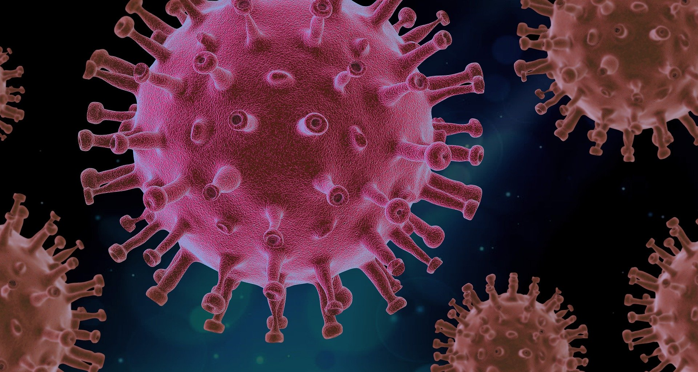
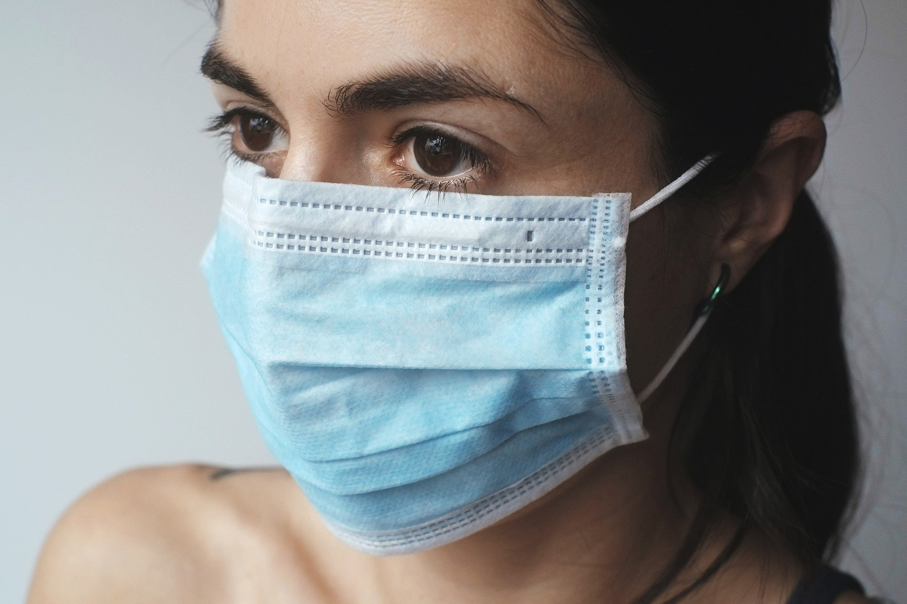

> NGS技术在临床上的应用逐步趋于成熟，从早期的肿瘤基因检测，到如今大热的微生物病原核酸检测，NGS技术以其快速、准确和高分辨率的特点，发挥着无可替代的作用。

微生物在地球上无处不在，从陆地到海洋，从衣物到皮肤，甚至我们的身体内部。

繁衍、变异、自然选择和生存斗争，是所有生物必须经历的。

因为生命的第一要义，是生存。 

为了生存，必须斗争，生物之间为了争夺资源，以及生物与自然环境之间，都存在着斗争 ，在这个过程中，有些微生物能够与人类和平共处，甚至互利共生，而有的微生物则会使人患病，通常有细菌、真菌、病毒、支原体，以及衣原体，这些就是临床上的病原微生物。

冠状病毒示意图

自然选择需要经历漫长的过程，但是近年来环境污染，药物滥用，加快了病原微生物的进化速度，耐药菌，超级菌的出现，严重威胁着人类健康。

还有一些微生物，本来与人类没有交集，原先只存在于自然界，而有人为了猎奇，食用野生动物，从而把这些动物身上携带的病毒带到了人类社会，如本世纪初的非典病毒（Severe Acute Respiratory Syndromes, SARS）就是例子，这类新型病毒对公共卫生健康形成了巨大的挑战，个别人的贪婪，给全世界的人们带来了巨大的灾难。

当健康受到了威胁，对付细菌，人类发明了抗生素， 对付病毒，发明了抗病毒药物，但要如何治疗，第一步是找出元凶，而这在临床上往往存在困难。

传统的血常规，或者器官和组织的影像学指标能够判断感染的可能性，但并不能作为确诊的依据，比如血常规只能告诉你是否有细菌或病毒感染，但不能告诉你是什么细菌或病毒，还需要进一步检查才能确诊，以便对症下药。

实验室检查，如抗原检测、核酸检测、代谢产物检测以及毒素检测才是明确感染、指导治疗和判断预后的重要手段。

- 细菌和真菌检测。通常需要先进行分离培养，再结合生化反应进行鉴定，并进一步进行药物敏感性试验，这种模式是临床微生物实验室惯用的经典模式，为临床解决了很多关键问题，然而其周期长、阳性率低、通量低等弊端往往难以满足临床日益增长的需求。

- 病毒、支原体、衣原体检测。难以像细菌一样进行分离培养，通常采用分子生物学方法如聚合酶链式反应（Polymerase Chain Reaction, PCR）测定核酸，灵敏快速，但只限于已知病原体的检测，且检测结果提供的信息相对有限，难以解决由变异带来的医学问题。

为了克服传统方法的不足，下一代测序技术（Next-generation sequencing technology，NGS）在病原微生物检测中的应用具有非常大的优势，如：

- 通量大，一次可检测成百上千个物种，特别是未知的病原，测定其核酸序列是必不可少的手段；
- 直接测定病原微生物的核酸序列，能为临床提供准确的诊断依据，如物种鉴定、分型以及耐药突变等；
- 更低的检测限，即使病原微生物的丰度很低，也能够检测到。

当然，NGS的缺点也是有的：

- 相对于PCR，时效性处于劣势；

- 成本较高，暂时不会完全取代现行的常规鉴定手段。

   

即便有不足，但NGS的技术优势更为明显，在疑难微生物，以及难以培养甚至无法分离培养的少见菌属的鉴定，特别是新型病原微生物的暴发流行监测方面，NGS快速、准确和高分辨率的特点，使其成为病毒鉴定的金标准，在流行病学分型中发挥着重要作用。

新型冠状病毒（Corona Virus Disease 2019, COVID-19）正肆虐全球，目前尚无疫苗和特效药，人们除了戴口罩，注意个人卫生以及增加社交距离外别无他法，面对汹涌的疫情，再一次提醒人类，要放下自己是万物之灵的傲慢，因为微生物才是当之无愧的地球之王，它们在这个星球上生存的历史比人类更长，种类和数量也比人类要多得多。

佩戴口罩防病毒感染

我们不能，也不应该试图消灭所有微生物。我们之间的关系，不只有对抗，还有合作，但是当我们的健康受到威胁时，也要勇于斗争。

物竞天择，适者生存，人类与微生物的合作与斗争，必将永远进行下去。

