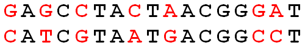

# 生物信息学算法之Python实现|Rosalind刷题笔记：006 计算点突变数

汉明距离的定义：对于两条长度相等的字符串来说，汉明距离指的是它们之间不相同的字符数。对于两条DNA，则是它们之间的点突变数目。

**给定：**两条长度相等的DNA序列（不超过1kb）。

**需得：**计算汉明距离。

## 示例数据

```bash
GAGCCTACTAACGGGAT
CATCGTAATGACGGCCT
```

## 示例结果

```bash
7
```

## Python实现

Counting_Point_Mutations.py

```python
import sys

def hamm(s1, s2):
    return sum([a != b for a, b in zip(s1, s2)])

def test():
    s1 = 'GAGCCTACTAACGGGAT'
    s2 = 'CATCGTAATGACGGCCT'
    return hamm(s1, s2) == 7

if __name__ == '__main__':
    if not test():
        print("hamm: Failed")
        sys.exit(1)

    lines = []
    with open('rosalind_hamm.txt') as fh:
        lines = fh.readlines()
    mutations = hamm(lines[0], lines[1])
    print(mutations)
```

汉明距离的计算：

1. zip()函数，将两条序列对应的元素打包成一个个元组；
2. 通过列表展开式判断对应元素是否不同；
3. sum()函数计算不相同的字符数，即为汉明距离。

## Problem

[](http://rosalind.info/media/problems/hamm/Hamming_distance.png)

**Figure 2**. The Hamming distance between these two strings is 7. Mismatched symbols are colored red.

Given two [strings](http://rosalind.info/glossary/string/) and of equal length, the [Hamming distance](http://rosalind.info/glossary/hamming-distance/) between and , denoted , is the number of corresponding symbols that differ in and . See [Figure 2](http://rosalind.info/media/problems/hamm/Hamming_distance.png).

**Given:** Two [DNA strings](http://rosalind.info/glossary/dna-string/) and of equal length (not exceeding 1 [kbp](http://rosalind.info/glossary/kbp/)).

**Return:** The Hamming distance .

## Sample Dataset

```
GAGCCTACTAACGGGAT
CATCGTAATGACGGCCT
```

## Sample Output

```
7
```

**Rosalind刷题计划：**

[生物信息学算法之Python实现|Rosalind刷题笔记：001 碱基统计](https://zhuanlan.zhihu.com/p/330815955)

[生物信息学算法之Python实现|Rosalind刷题笔记：002 中心法则：转录](https://zhuanlan.zhihu.com/p/331607752)

[生物信息学算法之Python实现|Rosalind刷题笔记：003 中心法则：翻译]()

生物信息学算法之Python实现|Rosalind刷题笔记：004 求DNA的反向互补序列

生物信息学算法之Python实现|Rosalind刷题笔记：005 计算GC含量

生物信息学算法之Python实现|Rosalind刷题笔记：006 计算点突变数


觉得内容不错，请点赞、评论或分享给需要的朋友吧！

[如果你热爱生物信息学，欢迎关注我的知乎](https://www.zhihu.com/people/jianzuoyi)，公众号：简说基因

博客地址：[https://jianzuoyi.github.io/](https://link.zhihu.com/?target=https%3A//jianzuoyi.github.io/)，在这里从零开始学生信